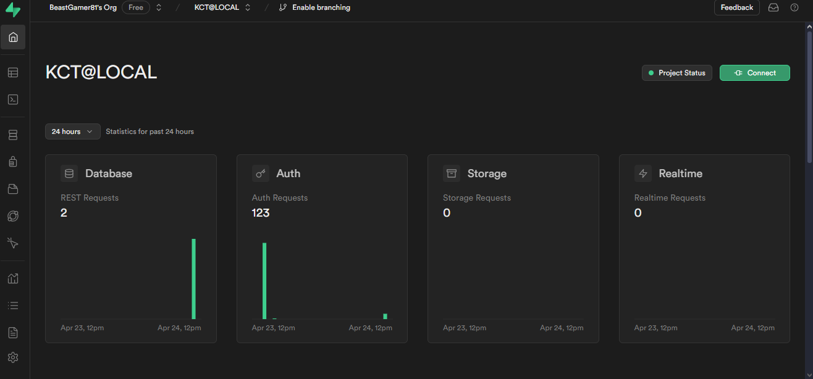
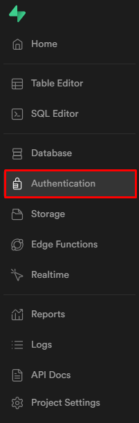
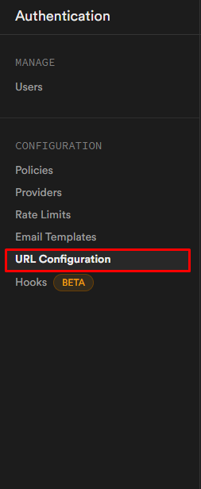
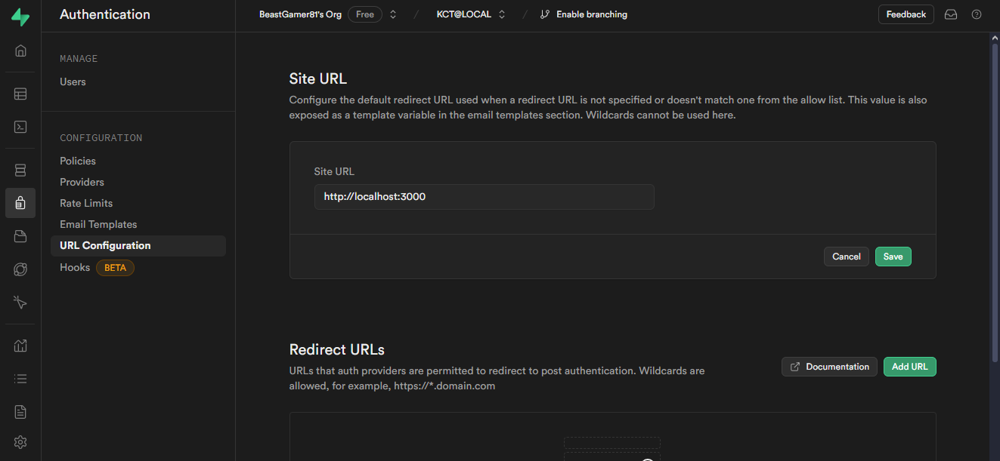
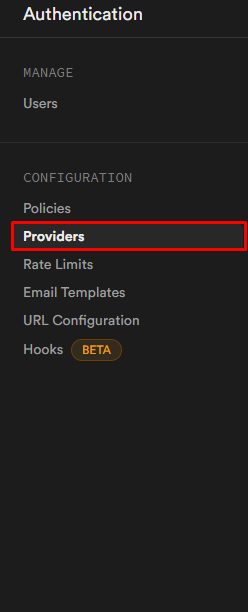
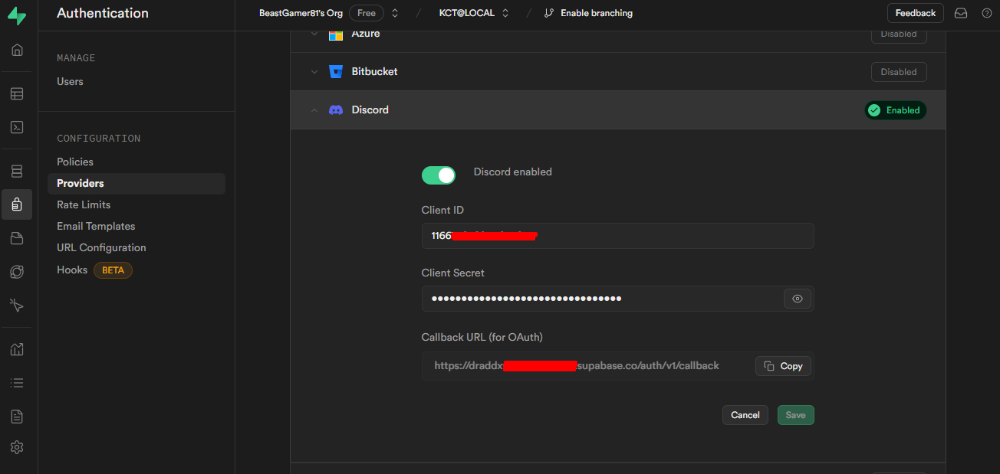

<head>
  <title>KlovitClient | SupaBase Configuration</title>
  <meta charset="utf-8" />
  <meta name="viewport" content="width=device-width, initial-scale=1, shrink-to-fit=no" />
  <meta name="description" content="The Next-Gen Developers" />
  <meta name="keywords" content="KlovitClient, Klovit" />
  <meta name="author" content="Klovit" />
  <meta name="copyright" content="Klovit" />
  <meta property="og:type" content="website" />
  <meta property="og:title" content="Klovit" />
  <meta property="og:description" content="The Next-Gen Developers." />
  <meta property="og:image" content="https://docs.klovit.tech/img/Klovit%20Logo.png" />
  <meta name="twitter:card" content="https://docs.klovit.tech/img/Klovit%20Logo.png" />
  <meta name="twitter:title" content="Klovit" />
  <meta name="twitter:description" content="The Next-Gen Developers." />
  <meta name="twitter:image" content="https://docs.klovit.tech/img/Klovit%20Logo.png" />
  <meta name="twitter:image:src" content="https://docs.klovit.tech/img/Klovit%20Logo.png" />
</head>
# Configuration
This page goes over the Supabase configuration for KlovitClient.

## Configuring your domain
Head over to the supabase project's dashboard e.g. https://supabase.com/dashboard/project/xxxxxxxxxxxxxxxxxxx
It should look like this:

The sidebar will expand as you hover on it, go to Authentication:

Now, go to URL Configuration:

You'll see something like this:

In the `Site URL` section, enter the URL of your dashboard e.g. `https://client.example.com/api/auth/callback`

NOTE: THE `/api/auth/callback` IS IMPORTANT IN THE SITE URL

## OAuth Providers
In this section we'll be adding OAuth to our KlovitClient instance.
On the same page where we added the Site URL to the project

For this example, we'll be going to configure Discord OAuth:

You have to fill in all the details to make the Discord OAuth function properly.